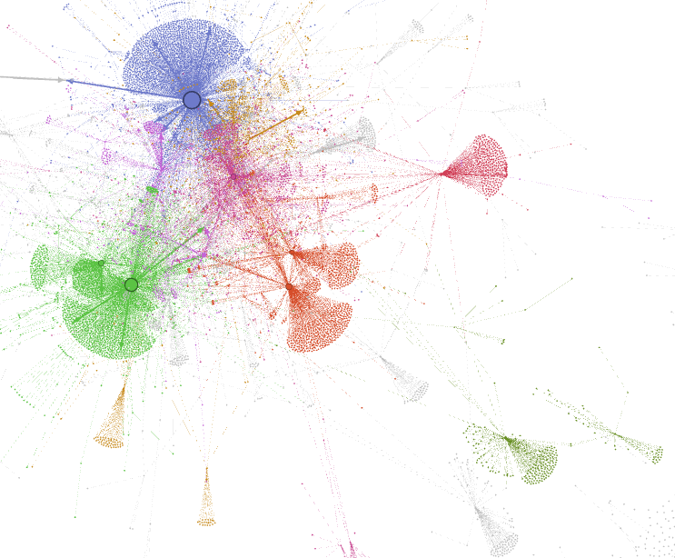
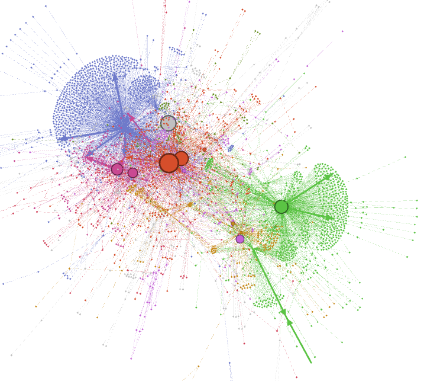

# Network Analysis of Deep Learning Packages in Python
This repository comprises of the source code my project under Prof. Nilam Kaushik in IIM Bangalore. 
The Project involved finding interelationships among machine learning packages avaialable and python and deducing the major differences in deep learning packages developed through Pytorch or developed through Tensorflow

# Dependencies
Dependencies can be installed by running the following command
```bash
pip install -r requirements.txt
```
## Data Extraction
Data Extraction was done through metadata available in pypi.porg and libraries.io
1. List of Package names was obtained using https://pypi.org/simple/
2. pypi metadata was extracted using https://pypi.org/pypi/<package>
3. libraries.io metadata was extracted using https://libraries.io/pypi/<package>


## Data Manipulation
1. First, dependencies data obtained through both metadata avaiable was merged
2. Filtered out Deep Learning packages using FUZZY-MATCH with associated keywords available for the packages
3. Exhaustive list of deep learning packages was formulated using this [paper](https://mdpi-res.com/d_attachment/proceedings/proceedings-47-00009/article_deploy/proceedings-47-00009-v4.pdf?version=1594348151)


## Network Analysis
Using the depencies data available, forumlated graphs to perform Network Analysis
1. Firstly, Treated each package as a unique node
2. Considering an edge only if atleast one of the nodes associated is a deep learning package
2. Then edges were created using three different methods
    1. Create an undirected edge between 2 package if one package is dependent on the other
    2. Create a directed edges from a deep learning package to all of its non deep learning dependendent packages
    3. Create a directed edges from a deep learning package to all of its deep learning dependendent packages
3. Performed Network Analysis individually on all 3 graphs using Gephi
    1. Layout using Yifan Hu Algorithm
    2. Clustering done through Modularity Class with different resolutions
    3. Nodes Size based on Betweeness Centrality of node

## Output and Screenshots
Cluster Description and Colours of Biggest Clusters- 
1. green - pytorch
2. blue - tensorflow
3. pink/orange - huggingface / fastai    
4. packages for hosting deep learning networks 
### ScreenShots
1. 
2. 
3. 

## Observations
1. Common Observations over all Graphs 
    1. Small size of torch denotes betweeness centrality of torch is quite small, which signifies packages dependent on pytorch are further dependencies of other packages
    2. big size of tensorflow denotes betweeness centrality of tensorflow is quite big, which signifies packages depedent on tensorflow are not dependencies of other packages
    3. This signifies packages developed using pytorch are used as building blocks for newer packages, whereas packages developed by tensoflow are sole purpose packgaes not dependencies of other packages. 
    4. This signifies that pytorch is much more flexible and offers much more abstraction capabilites, which could explain the shift of machine learning packages going towards pytorch instead of tensorflow.
    5. Also, packages developed by research institutions like fastai and huggingface acts as a "bridge" in between the clusters of pytorch and tensorflow, linking the 2 very different clusters. 
    6. Thus, these bridges which use both packages for different purposes come up with a "best of both worlds" picking the better package out of tensorflow and pytorch for individual tasks instead of completely relying on one of the packages    
2. All Edges
    1. When resolution is 5.0 (for Modularity Class), only 2 major clusters, signifying tensorflow and non-tensorflow packages
    2. When resolution is 1.0 (for Modularity Class), Many Clusters are observed with "bridge" seen clearly
3. Edges involving Deep Learning to non Deep Learning
    1. Only 3 Major Clusters observed, one for tensorflow, one for pytorch and one for the bridge (huggingface and fastai)
4. Edges involving Deep Learning to Non Deep Learning
    1. A Cluster Division tensorflow, pytorch, bridge cluster and datascience packages


